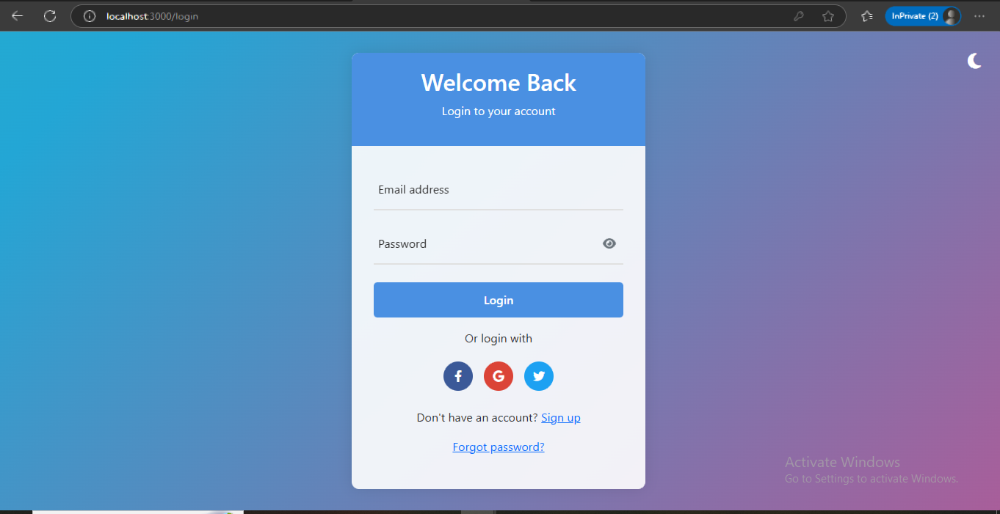
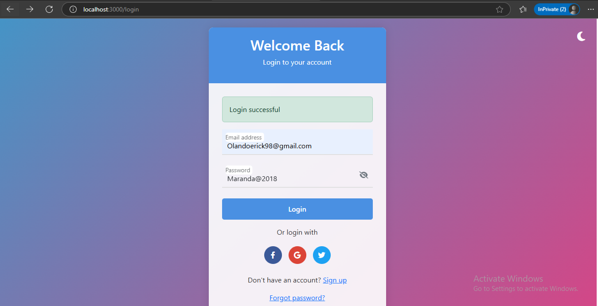
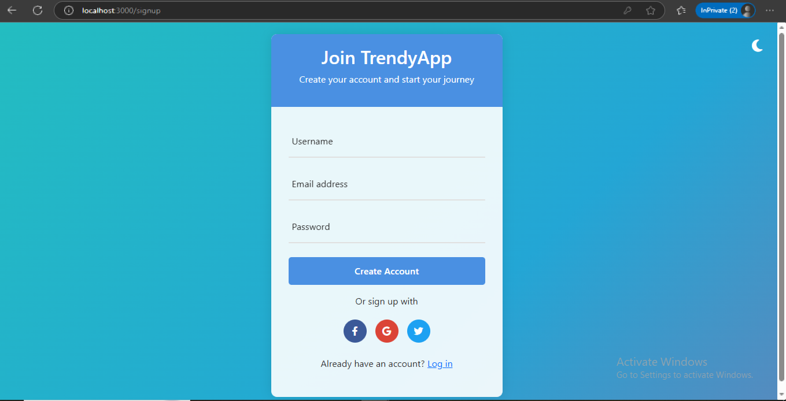
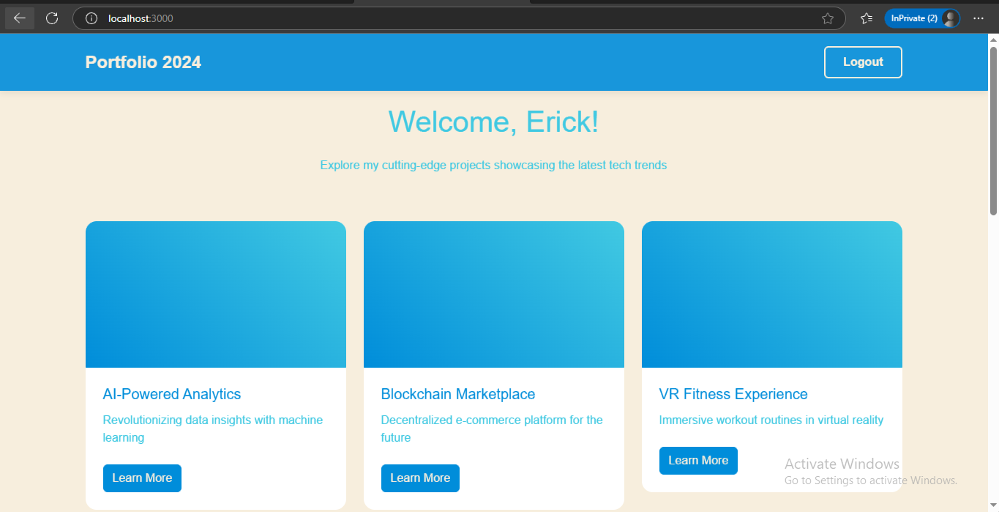

# 🔐 Secure Authentication App

A simple Node.js application with PostgreSQL for secure user registration and login, using bcrypt for password hashing and EJS for templating.

## 📌 Table of Contents

- [Features](#-features)
- [Tech Stack](#-tech-stack)
- [Getting Started](#-getting-started)
- [Database Setup](#-database-setup)
- [Available Routes](#-available-routes)
- [Screenshots](#-screenshots)
- [Project Structure](#-project-structure)
- [Security Notes](#-security-notes)
- [License](#-license)
- [Author](#-author)

---

## ✅ Features

- User registration with hashed passwords using bcrypt
- Login authentication with password comparison
- Secure PostgreSQL integration with parameterized queries
- Simple EJS frontend templates
- Clear error handling and user feedback
- smtp gmail service for verificatin,reset password e.tc

---

## 🧰 Tech Stack

- **Backend:** Node.js, Express
- **Database:** PostgreSQL
- **Templating Engine:** EJS
- **Middleware:** body-parser, morgan
- **Security:** bcrypt

---

## 🚀 Getting Started

1. Clone the repository:

```bash
git clone https://github.com/your-username/secure-auth-app.git
cd secure-auth-app
```

2. Install dependencies:

```bash
npm install
```

3. Create `views/` folder and add these `.ejs` files:
   - `index.ejs` (homepage)
   - `login.ejs` (login form)
   - `secrets.ejs` (protected page after login)

4. Start the development server:

```bash
node index.js
```

Server runs on [http://localhost:3000](http://localhost:3000)

---

## 🧱 Database Setup

1. Open PostgreSQL CLI or pgAdmin.
2. Create a new database:

```sql
CREATE DATABASE Secure;
```

3. Create the `users` table:

```sql
CREATE TABLE users (
    id SERIAL PRIMARY KEY,
    email VARCHAR(255) UNIQUE NOT NULL,
    password TEXT NOT NULL
);
```

---

## 🌐 Available Routes

| Method | Route         | Description                        |
|--------|---------------|------------------------------------|
| GET    | `/`           | Home page                          |
| GET    | `/login`      | Login form                         |
| POST   | `/register`   | Register new user                  |
| POST   | `/user-login` | Authenticate existing user         |

---

## 📸 Screenshots

> All screenshots are stored in the `/screenshots/` folder.

### 🏠 Homepage - `/`



---

### 🔐 Login Page - `/login`



---

### 📝 Register Page - `/register`



---

### 🎉 Secrets Page - After Successful Login



---

## 📁 Project Structure

```
secure-auth-app/
├── views/
│   ├── index.ejs
│   ├── login.ejs
│   └── secrets.ejs
├── screenshots/
│   ├── homepage.png
│   ├── login.png
│   ├── register.png
│   └── secrets.png
├── index.js
├── package.json
└── README.md
```

---

## 🔐 Security Notes

- Passwords are hashed using bcrypt with 12 salt rounds.
- SQL queries use parameterized values to prevent SQL injection.
- In production, database credentials should not be hardcoded. Use environment variables and `dotenv`.

### 📦 Example `.env` File

```
DB_USER=postgres
DB_HOST=localhost
DB_NAME=Secure
DB_PASS=your_password
DB_PORT=5432
```

Then in `index.js`, use:

```js
import dotenv from "dotenv";
dotenv.config();

const db = new pg.Client({
    user: process.env.DB_USER,
    host: process.env.DB_HOST,
    database: process.env.DB_NAME,
    password: process.env.DB_PASS,
    port: process.env.DB_PORT
});
```

---

## 📜 License

This project is licensed under the MIT License.  
Feel free to use, modify, and share.

---

## 👨‍💻 Author

**Erick Olando**  
🎓 Meteorologist & 💻 Software Developer  
📫 Email: erickolando98@gmail.com  
🔗 [GitHub](https://github.com/eritech98) | [LinkedIn](https://www.linkedin.com/in/erick-olando-9a9148220)
